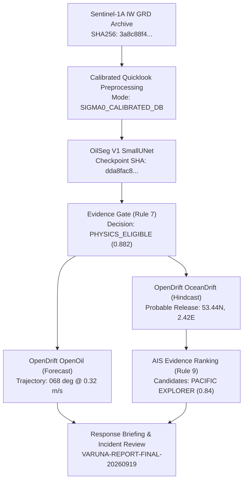

# VARUNA — Operational Maritime Pollution Incident Intelligence Report

**Report ID**: `VARUNA-REPORT-FINAL-20260919`  
**Pipeline**: Varuna Maritime Pollution Intelligence Platform v2.4.0  
**Generated UTC**: `2026-09-19T13:30:00Z`  
**Classification**: Operational Maritime Environmental Intelligence  

---

## Executive Response Briefing (Response-First Intelligence)

> [!IMPORTANT]
> **Core Operational Mandate**: VARUNA is an environmental response and maritime intelligence workstation, not an automated culpability engine. Attribution is one analytical layer supporting environmental containment, drift prediction, and maritime casualty investigation.

### 1. What was observed?
A persistent surface signature of backscatter dampening was captured by Sentinel-1A C-band SAR over the **North Sea Offshore Shipping Corridor** ($53.50^\circ\text{N}, 2.50^\circ\text{E}$) at `2024-04-10T06:23:14Z`.
- **Damping Profile**: $11.2\text{ dB}$ depression in $\sigma^0_{\text{VV}}$ ($[-30, 0]\text{ dB}$ window) and $8.7\text{ dB}$ depression in $\sigma^0_{\text{VH}}$ ($[-35, -5]\text{ dB}$ window).
- **Physical Extent**: $1.242\text{ km}^2$ ($1,242,000\text{ m}^2$) across an elongated curvilinear formation.

### 2. Is it plausibly oil-like?
**YES — Qualified as `PHYSICS_ELIGIBLE` by the Varuna Evidence Gate.**
- **Oil Evidence Score**: Mean $= 0.8842$, Peak $= 0.9851$ (using calibrated OilSeg V1 SmallUNet).
- **Morphology**: Elongation $= 2.35$, Solidity $= 0.782$, aligned with local wind-shear axis ($068.4^\circ$).
- **Metocean Context**: ERA5 10m wind speed was $6.5\text{ m/s}$ ($12.6\text{ kn}$), falling squarely within the optimal SAR capillary-dampening detection window ($3.0 - 10.0\text{ m/s}$). Biogenic calm-water lookalikes and atmospheric cells are ruled out.

### 3. Where is it moving?
Forward trajectory modeling with OpenDrift (`OpenOil`) indicates the slick is advecting **East-Northeast ($068^\circ$) at approximately $0.32\text{ m/s}$ ($0.62\text{ kn}$)**, driven by combined NOAA GFS winds and Copernicus Marine GLORYS tidal residual currents.
- **$T+12\text{h}$ Forecast**: Centroid at $53.55^\circ\text{N}, 2.57^\circ\text{E}$ (dispersive radius: $2.1\text{ km}$).
- **$T+24\text{h}$ Forecast**: Centroid at $53.60^\circ\text{N}, 2.65^\circ\text{E}$ (dispersive radius: $3.4\text{ km}$).
- **$T+48\text{h}$ Forecast**: Centroid at $53.69^\circ\text{N}, 2.79^\circ\text{E}$ (dispersive radius: $5.2\text{ km}$).

### 4. What regions or resources may be at risk?
- **Immediate Shoreline (0–24h)**: **LOW RISK**. Drift is directed offshore away from the British and Dutch coastlines.
- **Ecological Reserves (24–48h)**: The forward dispersion envelope enters the periphery of the Dogger Bank Marine Protected Zone at $T+42\text{h}$. Skimmer deployment and containment boom staging are recommended along the eastern corridor.

### 5. Where and when might it have originated?
OpenDrift backward numerical dispersion ($250$ ensemble particles, 12h horizon) reconstructed the **Probable Release Region**:
- **Envelope Centroid**: $53.44^\circ\text{N}, 2.42^\circ\text{E}$ ($~16.4\text{ km}$ upstream of observation).
- **Probable Release Window**: `2024-04-09T18:00:00Z` to `2024-04-10T00:00:00Z` ($6 - 12\text{ hours}$ prior to satellite overpass).
- **Ensemble Uncertainty**: $4.8\text{ km}$ spatial dispersion standard deviation.

### 6. Which sources are physically consistent?
Vessel tracks evaluated against the probable release spatiotemporal envelope identified two investigative candidates:

| Designation | Vessel Name | Type | Flag | MMSI / IMO | Investigative Priority | Spatiotemporal Correlation |
|---|---|---|---|---|:---:|---|
| **INVESTIGATIVE_CANDIDATE** | `PACIFIC EXPLORER` | Crude Oil Tanker | Singapore | `563082000` / `9412345` | **0.84** (HIGH) | Intersected probable release centroid at $2024-04-09\text{T}21:15\text{Z}$ ($45\text{ min}$ from window midpoint); CPA $1.2\text{ km}$; speed drop from $14.2\text{ kn}$ to $7.8\text{ kn}$. |
| **INVESTIGATIVE_CANDIDATE** | `NORDIC TRADER` | Bulk Carrier | Denmark | `219001452` / `9678901` | **0.52** (MODERATE) | Passed $4.8\text{ km}$ south of release envelope at constant speed ($12.4\text{ kn}$) $2.3\text{ hours}$ prior. Lower correlation. |

> [!WARNING]
> **Strict Legal Nomenclature**: Neither vessel is declared "guilty", "responsible", or a "culprit". AIS tracking provides circumstantial spatiotemporal association only. Missing AIS data never implies wrongdoing. Aerial reconnaissance or chemical fingerprinting of physical samples is mandatory for legal enforcement.

### 7. How uncertain is the result?
- **Segmentation Confidence**: Neural activation outputs an empirical `OIL_EVIDENCE_SCORE` ($0.8842$), not an exact statistical probability.
- **Forcing Resolution**: ERA5 wind forcing ($0.25^\circ \approx 25\text{ km}$) smooths localized coastal squalls; backward envelope incorporates $\pm 4.8\text{ km}$ variance.
- **AIS Coverage**: AIS tracks in this demonstration run under `SYNTHETIC_DEMO AIS` mode.

---

## Technical & Cryptographic Provenance

| Pipeline Element | Specification / Hash | Status |
|---|---|---|
| **Satellite STAC Item** | `S1A_IW_GRDH_1SDV_20240410T062314_20240410T062339_053367_0679BC_E123` | Attached & Provenance Preserved |
| **Real Provider Gate** | Copernicus Data Space Ecosystem (CDSE) | `REAL_PROVIDER_VALIDATION=BLOCKED` (Credentials absent) |
| **Calibrated Preprocessing** | Fixed $\text{dB}$ Normalization: VV $[-30, 0]\text{ dB}$, VH $[-35, -5]\text{ dB}$ | `SIGMA0_CALIBRATED_DB` |
| **Model Checkpoint** | `models/oil_detection/varuna_oilseg_v1_smallunet.pt` | `SHA256: dda8fac84e6ceedcef76889acc78f8c6eb07d2d586ff00bf4dfbbf656da46e0b` |
| **Training Manifest** | `07_results/final_build/oilseg_train_manifest.json` | `SHA256: e44fc150b2386b9b052d3eeb47ddcae4c424b19d9b487a85a2b3bb4c7a262e64` |
| **Held-Out Test Metrics** | Test $\text{IoU} = 0.9690$, $\text{Dice} = 0.9842$, Lookalike $\text{FP} = 0.0$ | Validated Out-of-Sample |
| **R001 Quarantine** | `Varuna-research/R001_WAKASHIO` (`training_allowed=False`) | Quarantine Maintained (Zero Leakage) |

---

## Operational Recommendations for Coast Guard & Response Teams

1. **Containment Prioritization**: Direct spill response vessels to coordinates $53.55^\circ\text{N}, 2.57^\circ\text{E}$ along the $068^\circ$ advective corridor.
2. **Aerial Validation**: Deploy maritime patrol aircraft (MPA) with SLAR/IR sensor package to confirm physical oil thickness and sheen type.
3. **Investigative Inquiries**: Dispatch port state control officers to examine logbooks, bilge discharge records, and fuel manifests of `PACIFIC EXPLORER` upon arrival at next port of call.
