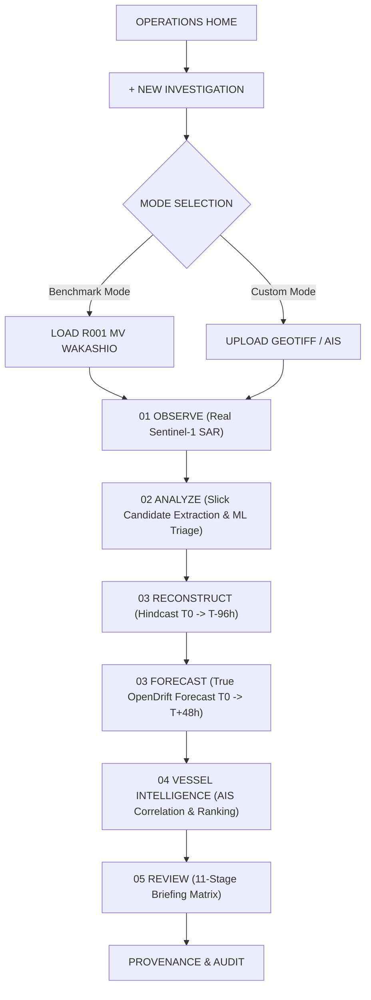

# SAMUDRANETRA — OPERATOR FUNCTIONAL FLOW SPECIFICATION

## Step-by-Step Operator Workflow

1. **OPERATIONS HOME**: Case dashboard displaying active cases, status badges (`DATA_READY`, `ANALYST_REVIEW_REQUIRED`), case creation button.
2. **01 OBSERVE**: View real Sentinel-1B SAR scene over Mauritius (`2020-08-10T01:38:07.500Z`). Inspect VV/VH backscatter bands, zoom/pan map, read metadata.
3. **02 ANALYZE**: Trigger candidate extraction. View 8 physics-eligible candidate hypotheses (from 45 triaged candidate groups). Select primary candidate `C4053` (`0.5818` ML oil-like score, area `1.42 km²`).
4. **03 RECONSTRUCT — HINDCAST**: Run OpenDrift backward ocean transport physics ($T0 \rightarrow T-96\text{h}$) under Scenario C (Currents + Wind + Stokes). View particle dispersion and source envelopes.
5. **03 RECONSTRUCT — FORECAST**: Run native OpenDrift forward particle transport forecast ($T0 \rightarrow T+48\text{h}$) using ERA5, HYCOM, and CMEMS extended post-observation forcing. View dispersion radius (`2.85 km`) and forcing support (`FULL FORCING SUPPORT`).
6. **04 VESSEL INTELLIGENCE**: Intersect reconstructed spatial source region with vessel tracks. Ingest MarineCadastre AIS CSV or synthetic demonstration AIS. View ranked vessel leads (`VESSEL_BETA` priority `0.907`).
7. **05 REVIEW**: View 11-stage incident briefing matrix, uncertainty propagation, limitation matrix, and cryptographic clean-room provenance SHA256 hashes.
